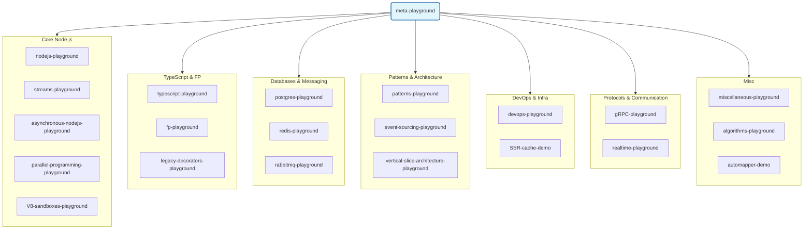

# meta-playground

Aggregated playground: all my learning repos as git submodules — algorithms, Node.js, TypeScript, DevOps, databases, patterns & more.



> [Версия на русском](./README.ru.md)

## Repos

### Core Node.js

| # | Repo | Language | Description | Use cases |
|---|------|----------|-------------|-----------|
| 1 | [nodejs-playground](https://github.com/Skippia/nodejs-playground) | JavaScript | • **Core Modules**: Deep dive into `path` (join vs resolve), `os`, `process` (env/argv), `url` (parsing), `events` (EventEmitter patterns), `stream` (pipe + backpressure), and `fs` (including a custom `promisify` implementation).<br>• **Clustering**: Multi-core forking with auto-recovery of dead workers.<br>• **HTTP Server**: Low-level server without frameworks, manual request/response handling. | CLI tools, process management, framework-free HTTP servers |
| 2 | [streams-playground](https://github.com/Skippia/streams-playground) | TypeScript | • **18 modules** across 3 categories: Node.js (ETL, TCP chat, CSV-to-NDJSON, AbortController), Browser (Web Streams API, streaming fetch), and Parallelism (Worker Threads, Child Processes).<br>• **SoX Audio**: Streaming internet radio with real-time effect mixing (applause, etc.) via SoX spawn.<br>• **Patterns**: Implementation of Observer/Pub-Sub using EventEmitter. | ETL pipelines, large file processing, media streaming, real-time chats |
| 3 | [asynchronous-nodejs-playground](https://github.com/Skippia/asynchronous-nodejs-playground) | TypeScript | • **Event Loop**: Visualization of phases (timers, I/O, poll, check, close), `process.nextTick`, and microtask queue behavior.<br>• **Scaling**: Hands-on with `worker_threads`, `cluster`, and PM2 management.<br>• **Architectures**: Implementation of the Actors model for concurrent processing.<br>• **Profiling**: Async debugger and baseline performance benchmarks. | Throughput optimization, event loop blocking diagnostics, PM2/cluster scaling |
| 4 | [parallel-programming-playground](https://github.com/Skippia/parallel-programming-playground) | TypeScript | • **Sync Primitives**: Custom Mutex (3 implementations), Binary/Counting Semaphores using `SharedArrayBuffer` and `Atomics`. Demos of Deadlock and Livelock.<br>• **Async Primitives**: Barrier, RWLock, BoundedChannel (Go/Rust style), and Rate Limiters (Token Bucket, Sliding Window).<br>• **Distributed**: Redis-based distributed lock with TTL and watchdog auto-renewal. | CPU-intensive tasks, rate limiting, connection pools, distributed locks |
| 5 | [V8-sandboxes-playground](https://github.com/Skippia/V8-sandboxes-playground) | JavaScript | • **Isolation**: Secure execution of untrusted code using `vm.Context`.<br>• **"The Matrix"**: Custom `safeRequire` (CJS) and `safeImport` (ESM) to intercept and whitelist modules.<br>• **Restricted API**: Controlled access to the file system (path restricted) and proxied globals like `console` and `timers`. | Plugin systems, user script execution, multi-tenant isolation |

### TypeScript & FP

| # | Repo | Language | Description | Use cases |
|---|------|----------|-------------|-----------|
| 6 | [typescript-playground](https://github.com/Skippia/typescript-playground) | TypeScript | • **42 Type-Level Challenges**: Comprehensive collection covering Mapped Types, Union Operations, Function Types (`infer`), String Manipulation (Template Literals), Tuple Operations, and Type-Level Arithmetic.<br>• **Deep Insights**: Demos of Covariance/Contravariance, Distributive Conditionals, and "Naked" types.<br>• **Utility Types**: Custom types like `DeepReadonly`, `Invert`, and `NoInfer`. | Type-safe libraries, complex generic APIs, SDK architecture |
| 7 | [fp-playground](https://github.com/Skippia/fp-playground) | TypeScript | • **Monadic Types**: Real-world usage of `Option`, `Either`, `Task`, `Reader`, `State`, and `Writer` from `fp-ts`.<br>• **Mini-Projects**: 6 projects including **Game of Life**, and data processing pipelines.<br>• **Advanced Concepts**: Sequence, Traversal, Kleisli composition, optics (sequences, traversal, TE-based), and Category Theory fundamentals. | Error-handling pipelines, data transformations, side-effect management |
| 8 | [legacy-decorators-playground](https://github.com/Skippia/legacy-decorators-playground) | TypeScript | • **Decorator Mastery**: Implementation of method/class decorators and factories with `experimentalDecorators`.<br>• **Metadata**: Usage of `reflect-metadata` for design-time type/param-type/return-type emission. | NestJS/Angular style DI, ORM development, validation libraries |

### Databases & Messaging

| # | Repo | Language | Description | Use cases |
|---|------|----------|-------------|-----------|
| 9 | [postgres-playground](https://github.com/Skippia/postgres-playground) | TypeScript / SQL | • **SQL Power**: Advanced usage of CTEs, RCTEs, Window Functions, and JSONB queries.<br>• **Extensions**: Practical implementation with `pg_cron` for scheduling and `pg_ivm` for incremental materialized views.<br>• **Features**: Full-text/fuzzy search, domain types, Materialized Views with triggers/notify, and Advisory Locks. | Complex analytics, full-text search, job scheduling, sharding strategies |
| 10 | [redis-playground](https://github.com/Skippia/redis-playground) | TypeScript | • **Monorepo Architecture**: NestJS/ioredis integration, SvelteKit auctions, and a Vue 3 search UI.<br>• **Advanced Redis**: RediSearch, HyperLogLog, Lua scripts (incrementView, unlock), and Redis Transactions (WATCH/MULTI).<br>• **Patterns**: Redlock for distributed consistency and optimistic locking in multi-process apps. | Sessions, distributed locks, real-time search, caching, real-time auctions |
| 11 | [rabbitmq-playground](https://github.com/Skippia/rabbitmq-playground) | TypeScript | • **10 Core Examples**: From simple Pub-Sub to Topic Exchanges, RPC, and Consistent Hashing.<br>• **Reliability**: 3 Publisher Confirm strategies (sync, batch, async) and 3 Retry mechanisms (DLX, Exponential Backoff, Delay Plugin).<br>• **Infrastructure**: 3-node HA cluster with HAProxy, Shovels, and Performance benchmarks (Clinic.js). | Event-driven microservices, reliable messaging, retry/DLQ strategies |

### Patterns & Architecture

| # | Repo | Language | Description | Use cases |
|---|------|----------|-------------|-----------|
| 12 | [patterns-playground](https://github.com/Skippia/patterns-playground) | TypeScript | • **Design Patterns**: Implementation of GoF patterns (8 Behavioral, 1 Creational, 3 Structural).<br>• **Techniques**: Custom `thenable` classes, `mixins`, `memoize` (sync/async), and `Object Pool` (dumb vs smart).<br>• **DDD & More**: `Specification` pattern, `Revealing Constructor`, and `Factorify`. | Clean architecture, plugin systems, robust state management |
| 13 | [event-sourcing-playground](https://github.com/Skippia/event-sourcing-playground) | TypeScript | • **5 Progressive Examples**: Maritime shipping domain, from basic `apply/replay` to `Memento`-based event reversal.<br>• **Retroactivity**: Handling `Rejection` and `Replacement` of historical events with rewind/replay logic.<br>• **Side Effects**: `ReplayBuffer` for differential side-effect management (cancel/re-notify).<br>• **QueryLog**: Caching external service calls for consistent replay results. | Audit trails, undo/redo systems, temporal queries, finance/logistics |
| 14 | [vertical-slice-architecture-playground](https://github.com/Skippia/vertical-slice-architecture-playground) | TypeScript | • **Two Implementations**: Basic (Drizzle + SQLite) and Production (PostgreSQL + RabbitMQ) setups.<br>• **VSA + CQRS**: Feature-based organization using NestJS + CQRS module, focus on reducing coupling.<br>• **Production Grade**: Winston logging with Trace IDs, Joi validation, and 30 E2E tests per version. | Feature-driven development, CQRS architectures, modern NestJS |

### DevOps & Infra

| # | Repo | Language | Description | Use cases |
|---|------|----------|-------------|-----------|
| 15 | [devops-playground](https://github.com/Skippia/devops-playground) | YAML / Dockerfile | • **Docker Compose Treasures**: Collection of production-ready stacks including Adminer, Nginx, Swiggy microservices, and NestJS + RabbitMQ.<br>• **Kubernetes**: AWS EKS manifests (with EFS CSI storage), local Kubernetes dev environments, and Mongo Express deployments.<br>• **CI/CD**: GitHub Actions workflows for backend (Prisma/Vitest) and frontend (Vercel deploy). | Infrastructure-as-code, containerization, K8s orchestration |
| 16 | [SSR-cache-demo](https://github.com/Skippia/SSR-cache-demo) | TypeScript | • **3 Caching Strategies**: SWR via `routeRules`, `ETag` + `Cache-Control` (304 Not Modified), and Server Middleware + External Storage.<br>• **Performance**: TTFB optimization and reduced server render load. | SSR performance optimization, CDN caching strategies |

### Protocols & Communication

| # | Repo | Language | Description | Use cases |
|---|------|----------|-------------|-----------|
| 17 | [gRPC-playground](https://github.com/Skippia/gRPC-playground) | TypeScript | • **Eliza Service**: Implementation from `.proto` using `buf` and `protoc-gen-ts`.<br>• **Ecosystem**: Comparison of `@grpc/grpc-js` vs `@connectrpc` stacks.<br>• **Features**: Interceptors, server reflection, health checks, streaming types, and retry/deadline policies. | High-performance RPC, microservice APIs, data streaming |
| 18 | [realtime-playground](https://github.com/Skippia/realtime-playground) | JavaScript / TypeScript | • **7 mini-chat implementations**: Evolution from Short/Long Polling and SSE to HTTP/2 Streams and WebSockets.<br>• **Scaling**: Horizontal WebSocket scaling with **Redis Adapter** behind HAProxy.<br>• **Collaborative**: Vue 3 + Pinia + WS spreadsheet demo. | Real-time dashboards, collaborative apps, chat systems |

### Misc

| # | Repo | Language | Description | Use cases |
|---|------|----------|-------------|-----------|
| 19 | [miscellaneous-playground](https://github.com/Skippia/miscellaneous-playground) | JavaScript | • **10 Standalone Demos**: Quirks like `undefined` shadowing, short-circuit evaluation side-effects, autoboxing, and prototype pollution.<br>• **Async Tracking**: Debugging async stack trace loss and `return await` behavior.<br>• **Serializing**: Making non-enumerable `Error` objects serializable for JSON. | Debugging, security audits, deep JS understanding |
| 20 | [algorithms-playground](https://github.com/Skippia/algorithms-playground) | JavaScript / TypeScript | • **Collection**: Sorting (Bubble, Merge, Quick), Search (Binary, BFS, Dijkstra), and Data Structures (Linked List, Hash Table, BST).<br>• **Puzzles**: Fibonacci (naive vs memoized), Sieve of Eratosthenes, Caesar Cipher, and Max Profit. | Coding interviews, algorithm mastery, data structures |
| 21 | [automapper-demo](https://github.com/Skippia/automapper-demo) | TypeScript | • **@automapper**: Demos of `Classes` (decorator-based) and `POJOs` (plain objects) mapping strategies.<br>• **Transformation**: Clean entity-to-DTO conversion in layered architectures. | DTO mapping, API response formatting |

## Setup

```bash
# Clone with all submodules
git clone --recurse-submodules git@github.com:Skippia/meta-playground.git

# Or init submodules after clone
git submodule update --init --recursive
```
