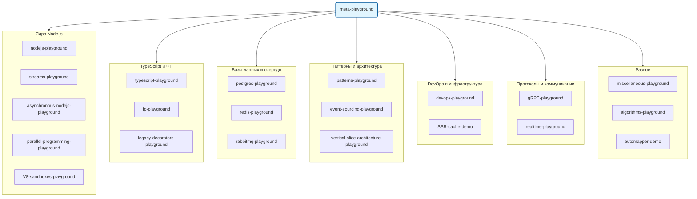

# meta-playground

Агрегированный playground: все мои учебные репозитории как git-подмодули — алгоритмы, Node.js, TypeScript, DevOps, базы данных, паттерны и многое другое.



> [English version](./README.md)

## Репозитории

### Ядро Node.js

| # | Репозиторий | Язык | Описание | Варианты использования |
|---|-------------|------|----------|------------------------|
| 1 | [nodejs-playground](https://github.com/Skippia/nodejs-playground) | JavaScript | • **Встроенные модули**: Глубокое погружение в `path` (join vs resolve), `os`, `process` (env/argv), `url` (парсинг), `events` (паттерны EventEmitter), `stream` (pipe + backpressure) и `fs` (включая кастомную реализацию `promisify`).<br>• **Кластеризация**: Форкинг на несколько ядер с автовосстановлением упавших воркеров.<br>• **HTTP-сервер**: Низкоуровневый сервер без фреймворков, ручная обработка req/res. | CLI-утилиты, процесс-менеджмент, HTTP-серверы без фреймворков |
| 2 | [streams-playground](https://github.com/Skippia/streams-playground) | TypeScript | • **18 модулей** в 3 категориях: Node.js (ETL, TCP-чат, CSV-to-NDJSON, AbortController), Браузер (Web Streams API, потоковый fetch) и Параллелизм (Worker Threads, Child Processes).<br>• **SoX Audio**: Потоковое интернет-радио с микшированием эффектов в реальном времени (аплодисменты и др.) через SoX.<br>• **Паттерны**: Реализация Observer/Pub-Sub на базе EventEmitter. | ETL-пайплайны, обработка больших файлов, медиа-стриминг, чаты |
| 3 | [asynchronous-nodejs-playground](https://github.com/Skippia/asynchronous-nodejs-playground) | TypeScript | • **Event Loop**: Визуализация фаз (timers, I/O, poll, check, close), `process.nextTick` и очереди микрозадач.<br>• **Масштабирование**: Практика с `worker_threads`, `cluster` и управлением через PM2.<br>• **Архитектуры**: Реализация модели акторов (Actors model) для конкурентной обработки.<br>• **Профилирование**: Async-отладчик и базовые бенчмарки производительности. | Оптимизация throughput, диагностика блокировки event loop, масштабирование PM2/cluster |
| 4 | [parallel-programming-playground](https://github.com/Skippia/parallel-programming-playground) | TypeScript | • **Sync-примитивы**: Кастомные Mutex (3 реализации), бинарные и счётные семафоры на базе `SharedArrayBuffer` и `Atomics`. Демо Deadlock и Livelock.<br>• **Async-примитивы**: Barrier, RWLock, BoundedChannel (в стиле Go/Rust) и Rate Limiters (Token Bucket, Sliding Window).<br>• **Распределённые системы**: Блокировка на базе Redis с TTL и автопродлением (watchdog). | CPU-интенсивные задачи, rate limiting, пулы соединений, распределённые блокировки |
| 5 | [V8-sandboxes-playground](https://github.com/Skippia/V8-sandboxes-playground) | JavaScript | • **Изоляция**: Безопасное исполнение кода через `vm.Context`.<br>• **"Матрица"**: Кастомные `safeRequire` (CJS) и `safeImport` (ESM) для перехвата и фильтрации модулей по белому списку.<br>• **Ограничение API**: Контролируемый доступ к ФС и проксирование глобальных объектов (`console`, `timers`). | Плагин-системы, исполнение пользовательских скриптов, мультитенантная изоляция |

### TypeScript и ФП

| # | Репозиторий | Язык | Описание | Варианты использования |
|---|-------------|------|----------|------------------------|
| 6 | [typescript-playground](https://github.com/Skippia/typescript-playground) | TypeScript | • **42 задачи на уровне типов**: Глубокое изучение Mapped Types, операций над Union, типов функций (`infer`), манипуляций со строками (Template Literals) и арифметики на типах.<br>• **Глубокие инсайты**: Демонстрация ковариантности/контравариантности, дистрибутивных типов и "голых" типов.<br>• **Utility-типы**: Реализация `DeepReadonly`, `Invert` и `NoInfer`. | Типобезопасные библиотеки, сложные generic-API, архитектура SDK |
| 7 | [fp-playground](https://github.com/Skippia/fp-playground) | TypeScript | • **Монадические типы**: Использование `Option`, `Either`, `Task`, `Reader`, `State` и `Writer` из библиотеки `fp-ts`.<br>• **Мини-проекты**: 6 проектов, включая **Game of Life** и пайплайны обработки данных.<br>• **Продвинутые концепции**: Sequence, Traversal, композиция Клейсли, оптики и основы теории категорий. | Пайплайны обработки ошибок, DI через Reader, управление эффектами |
| 8 | [legacy-decorators-playground](https://github.com/Skippia/legacy-decorators-playground) | TypeScript | • **Мастерство декораторов**: Реализация декораторов методов, классов и фабрик с использованием `experimentalDecorators`.<br>• **Метаданные**: Работа с `reflect-metadata` для эмиссии типов параметров и возвращаемых значений во время выполнения. | NestJS/Angular-style DI, разработка ORM, библиотеки валидации |

### Базы данных и очереди сообщений

| # | Репозиторий | Язык | Описание | Варианты использования |
|---|-------------|------|----------|------------------------|
| 9 | [postgres-playground](https://github.com/Skippia/postgres-playground) | TypeScript / SQL | • **Мощь SQL**: Продвинутое использование CTE, RCTE, оконных функций и JSONB-запросов.<br>• **Расширения**: Практическая работа с `pg_cron` (планировщик) и `pg_ivm` (инкрементальные материализованные представления).<br>• **Фичи**: Полнотекстовый и нечёткий поиск, доменные типы, MV с триггерами/нотификациями и Advisory Locks. | Сложная аналитика, полнотекстовый поиск, планировщик задач |
| 10 | [redis-playground](https://github.com/Skippia/redis-playground) | TypeScript | • **Архитектура монорепо**: Интеграция NestJS/ioredis, аукционы на SvelteKit и поисковый UI на Vue 3.<br>• **Продвинутый Redis**: RediSearch, HyperLogLog, Lua-скрипты и транзакции (WATCH/MULTI).<br>• **Паттерны**: Redlock для распределённой консистентности и оптимистичные блокировки. | Сессии, распределённые блокировки, real-time поиск, кэширование |
| 11 | [rabbitmq-playground](https://github.com/Skippia/rabbitmq-playground) | TypeScript | • **10 практических примеров**: От базового Pub-Sub и Topic Exchange до RPC и Consistent Hashing.<br>• **Надёжность**: 3 стратегии подтверждения (sync, batch, async) и 3 механизма повторов (DLX, Exponential Backoff, Delay Plugin).<br>• **Инфраструктура**: Кластер из 3 нод с HAProxy, Shovels и бенчмарки (Clinic.js). | Микросервисная коммуникация, надёжные очереди, стратегии повторов |

### Паттерны и архитектура

| # | Репозиторий | Язык | Описание | Варианты использования |
|---|-------------|------|----------|------------------------|
| 12 | [patterns-playground](https://github.com/Skippia/patterns-playground) | TypeScript | • **Паттерны GoF**: Реализация 8 поведенческих, 1 порождающего и 3 структурных паттернов.<br>• **Техники**: Кастомные `thenable` классы, миксины, `memoize` (sync/async) и `Object Pool` (глупый и умный).<br>• **DDD и др.**: Паттерн `Specification`, `Revealing Constructor` и `Factorify`. | Чистая архитектура, плагин-системы, управление состоянием |
| 13 | [event-sourcing-playground](https://github.com/Skippia/event-sourcing-playground) | TypeScript | • **5 последовательных примеров**: Домен морских перевозок, от базового `apply/replay` до реверсии событий на базе `Memento`.<br>• **Ретроактивность**: Обработка отмены и замены исторических событий с логикой перемотки (rewind/replay).<br>• **Побочные эффекты**: `ReplayBuffer` для дифференциального управления эффектами (cancel/re-notify).<br>• **QueryLog**: Кэширование внешних вызовов для консистентного воспроизведения. | Аудит-трейлы, системы отмены (undo/redo), темпоральные запросы |
| 14 | [vertical-slice-architecture-playground](https://github.com/Skippia/vertical-slice-architecture-playground) | TypeScript | • **Две реализации**: Базовая (Drizzle + SQLite) и продакшн (PostgreSQL + RabbitMQ).<br>• **VSA + CQRS**: Организация кода по фичам с использованием NestJS + CQRS для минимизации связанности.<br>• **Production-grade**: Логирование Winston с Trace ID, валидация Joi и 30 E2E-тестов на версию. | Feature-driven разработка, CQRS-архитектуры, современный NestJS |

### DevOps и инфраструктура

| # | Репозиторий | Язык | Описание | Варианты использования |
|---|-------------|------|----------|------------------------|
| 15 | [devops-playground](https://github.com/Skippia/devops-playground) | YAML / Dockerfile | • **Docker Compose Treasures**: Коллекция готовых стеков (Adminer, Nginx, Swiggy микросервисы, NestJS + RabbitMQ).<br>• **Kubernetes**: Манифесты AWS EKS (с хранилищем EFS CSI), локальные среды разработки и деплой Mongo Express.<br>• **CI/CD**: Пайплайны GitHub Actions для бэкенда (Prisma/Vitest) и фронтенда (Vercel). | Инфраструктура как код, контейнеризация, оркестрация K8s |
| 16 | [SSR-cache-demo](https://github.com/Skippia/SSR-cache-demo) | TypeScript | • **3 стратегии кэширования**: SWR через `routeRules`, `ETag` + `Cache-Control` (304 Not Modified) и серверная Middleware с внешним хранилищем.<br>• **Производительность**: Оптимизация TTFB и снижение нагрузки на SSR-рендеринг. | Оптимизация SSR, стратегии кэширования CDN |

### Протоколы и коммуникация

| # | Репозиторий | Язык | Описание | Варианты использования |
|---|-------------|------|----------|------------------------|
| 17 | [gRPC-playground](https://github.com/Skippia/gRPC-playground) | TypeScript | • **Eliza Service**: Реализация из `.proto` файла с использованием `buf` и `protoc-gen-ts`.<br>• **Экосистема**: Сравнение стеков `@grpc/grpc-js` и `@connectrpc`.<br>• **Фичи**: Интерцепторы, серверная рефлексия, health-чеки, типы стриминга и политики повторов (retry). | Высокопроизводительные RPC, API микросервисов, стриминг данных |
| 18 | [realtime-playground](https://github.com/Skippia/realtime-playground) | JavaScript / TypeScript | • **7 реализаций чата**: Эволюция от Short/Long Polling и SSE до HTTP/2 Streams и WebSocket.<br>• **Масштабирование**: Горизонтальное масштабирование WebSocket через **Redis Adapter** за HAProxy.<br>• **Совместная работа**: Демонстрация совместного редактирования таблиц на Vue 3 + Pinia + WS. | Чат-системы, real-time дашборды, совместная работа |

### Разное

| # | Репозиторий | Язык | Описание | Варианты использования |
|---|-------------|------|----------|------------------------|
| 19 | [miscellaneous-playground](https://github.com/Skippia/miscellaneous-playground) | JavaScript | • **10 изолированных демо**: Странности JS (shadowing `undefined`), побочные эффекты short-circuit вычислений, автобоксинг и prototype pollution.<br>• **Async-трекинг**: Отладка потери async stack trace и поведение `return await`.<br>• **Сериализация**: Превращение non-enumerable свойств `Error` в сериализуемые данные для JSON. | Глубокое понимание JS, отладка, аудит безопасности |
| 20 | [algorithms-playground](https://github.com/Skippia/algorithms-playground) | JavaScript / TypeScript | • **Коллекция**: Сортировки (Bubble, Merge, Quick), поиск (Binary, BFS, Dijkstra) и структуры данных (Linked List, Hash Table, BST).<br>• **Задачи**: Фибоначчи (наивная vs мемоизированная), Решето Эратосфена, Шифр Цезаря и Max Profit. | Подготовка к интервью, изучение алгоритмов и структур данных |
| 21 | [automapper-demo](https://github.com/Skippia/automapper-demo) | TypeScript | • **@automapper**: Демонстрация стратегий маппинга `Classes` (на декораторах) и `POJOs` (простые объекты).<br>• **Трансформация**: Чистое преобразование Entity в DTO в слоистых архитектурах. | Маппинг DTO, форматирование API-ответов |

## Установка

```bash
# Клонировать со всеми подмодулями
git clone --recurse-submodules git@github.com:Skippia/meta-playground.git

# Или инициализировать подмодули после клонирования
git submodule update --init --recursive
```
